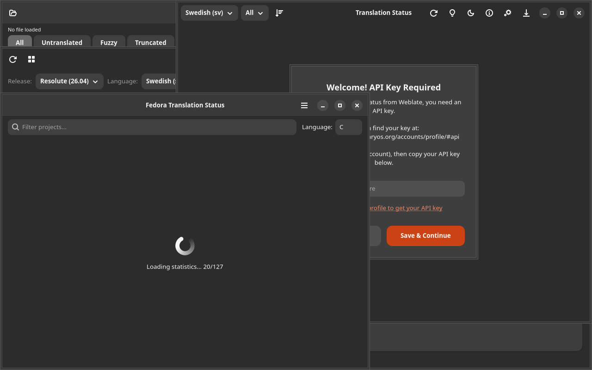

# OBD2 Viewer

[](https://github.com/yeager/obd2-viewer/releases)
[](https://www.gnu.org/licenses/gpl-3.0)
[](https://www.transifex.com/danielnylander/obd2-viewer/)

OBD-II diagnostic data viewer and logger — GTK4/Adwaita.



## Features

- **Live data** — read OBD-II PIDs in real time
- **Diagnostic codes** — read and clear DTCs
- **Data logging** — record sessions to CSV
- **Gauges** — visual RPM, speed, temperature displays
- **Vehicle info** — VIN, ECU details
- **CSV export** — export logs with app branding (Ctrl+E)
- **Dark/light theme** toggle

## Installation

### Debian/Ubuntu

```bash
echo "deb [signed-by=/usr/share/keyrings/yeager-keyring.gpg] https://yeager.github.io/debian-repo stable main" | sudo tee /etc/apt/sources.list.d/yeager.list
curl -fsSL https://yeager.github.io/debian-repo/yeager-keyring.gpg | sudo tee /usr/share/keyrings/yeager-keyring.gpg > /dev/null
sudo apt update && sudo apt install obd2-viewer
```

### Fedora/openSUSE

```bash
sudo dnf config-manager --add-repo https://yeager.github.io/rpm-repo/yeager.repo
sudo dnf install obd2-viewer
```

### From source

```bash
git clone https://github.com/yeager/obd2-viewer.git
cd obd2-viewer && pip install -e .
obd2-viewer
```

## Translation

Help translate on [Transifex](https://www.transifex.com/danielnylander/obd2-viewer/).

## License

GPL-3.0-or-later — see [LICENSE](LICENSE) for details.

## Author

**Daniel Nylander** — [danielnylander.se](https://danielnylander.se)
